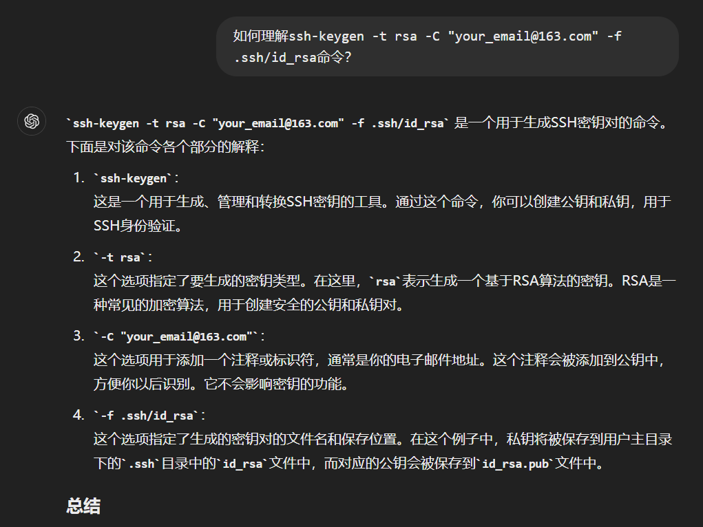
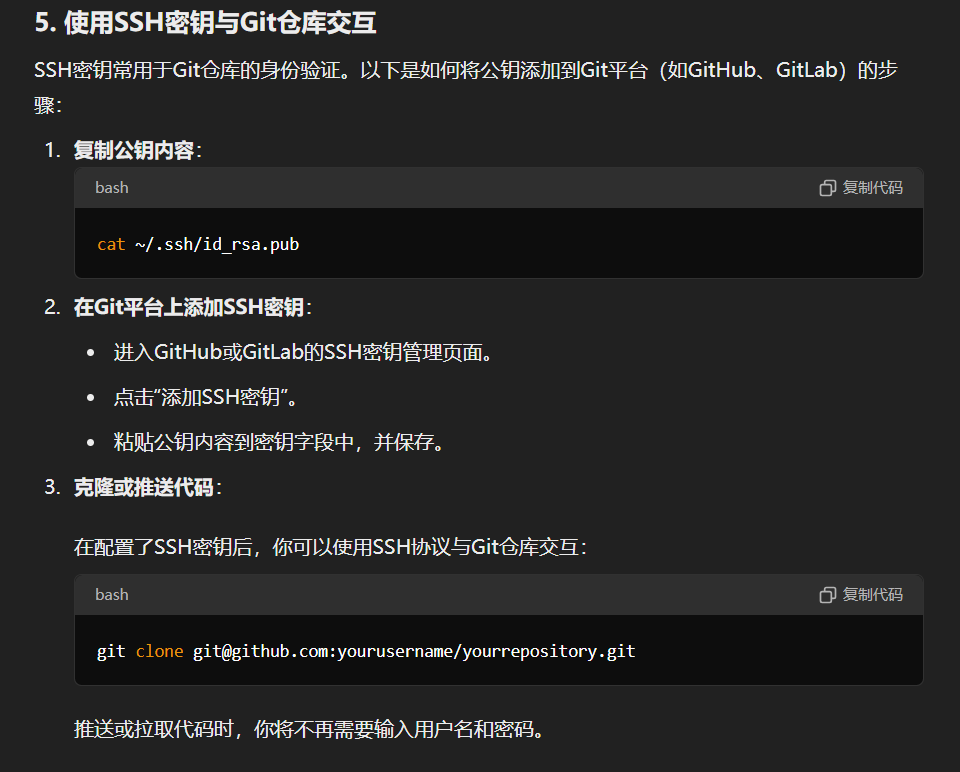
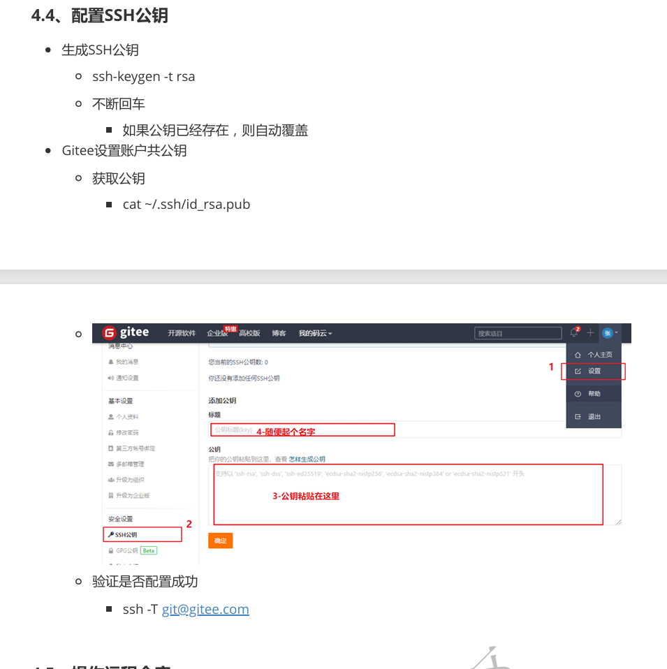
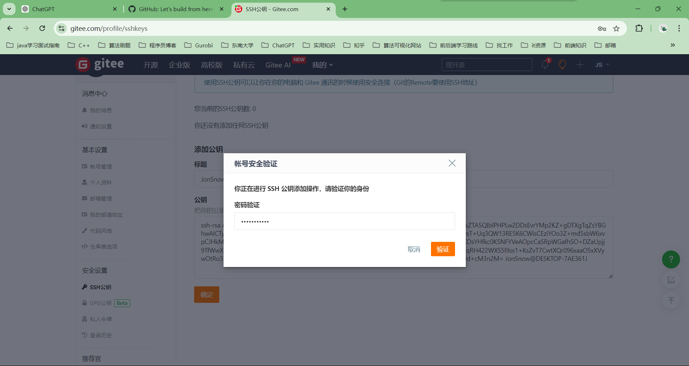
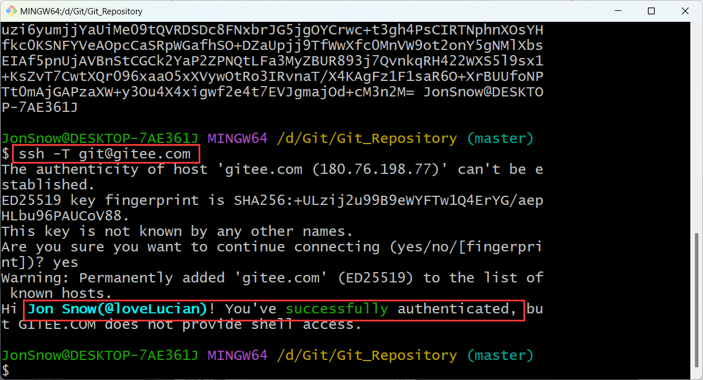

# Git

## 1、git

### 是什么：

Git是一种分布式版本控制系统，用于跟踪和管理源代码的变化。

1. **版本控制**：
   - 版本控制系统（VCS）是一种软件工具，帮助开发人员管理项目源代码的更改。它们记录代码的每个更改，以便在需要时能够恢复到以前的状态。
   - Git是一个分布式版本控制系统，这意味着每个开发人员的工作副本中都有一个完整的代码库历史记录。
2. **分布式**：
   - 在Git中，每个开发者的工作目录都是一个完整的代码库，包括完整的历史记录，不需要依赖中央服务器。
   - 这使得团队可以在离线状态下工作，并在方便的时候同步他们的工作。
3. **存储机制**：
   - Git采用快照存储，而不是差异存储。每次提交代码时，Git会为所有文件创建一个快照并保存，而不是仅仅记录文件的差异。
   - 如果文件没有更改，Git不会重新存储文件，而是仅仅保留一个指向先前存储文件的指针。

### 为什么：

### 怎么办：

#### （1）集中式版本控制工具svn和分布式版本控制工具git

==架构==

- **SVN**：集中式版本控制系统（CVCS）。代码仓库存储在一个中央服务器上，开发者从中央服务器检出（checkout）代码并提交（commit）更改。所有的版本历史记录也都存储在中央服务器上。
- **Git**：分布式版本控制系统（DVCS）。每个开发者的工作目录都是一个完整的代码仓库，包括所有的版本历史记录。开发者可以在本地仓库中提交更改，然后将更改推送到远程仓库。

==工作流程==

- **SVN**：开发者需要连接到中央服务器才能提交更改和查看历史记录。工作流程通常是检出代码、修改、提交。
- **Git**：开发者可以在本地仓库中提交更改，然后在适当的时候将更改推送到远程仓库。工作流程包括克隆（clone）仓库、创建分支、修改代码、提交更改、合并分支、推送（push）和拉取（pull）更改。

#### （2）Git工作流程

## 2、git安装与常用命令

### （1）git下载与安装

### （2）git基本配置

#### ①设置与查看用户信息

#### ②为常用指令配置别名（可选）

#### ③解决gitbash乱码问题

### （3）创建本地仓库

注意这里的.git目录是隐藏起来的，需要设置让它显示出来

#### notes：如何理解git仓库？

仓库的作用是用来存放文件的，git仓库也不例外，git仓库里面的文件具体又是放在一个个分支上面的，当创建一个仓库以后会生成一个默认的主分支，初始的时候所有文件都是存放在这个主分支上的，这个主分支的名称是 `main`或者 `master`（具体取决于git版本），这个主分支目前是不存在的只有当执行了commit操作以后分支才实际存在。

### （4）基础操作指令

#### ①`git status`查看当前分支下文件的修改状态（文件是否被添加到暂存区、是否被提交到本地仓库等）

#### ②`git add 文件名`将当前分支下指定的文件添加到暂存区

这里`git add 单个文件名`就是将单个文件的修改添加到暂存区，`git add .`通配符的形式就是将所有文件的修改添加到暂存区

#### ③`git commit`将当前分支下暂存区的内容提交到本地仓库（commit操作会影响本地仓库中的当前分支，不会影响仓库中别的分支）

notes：`git commit -m '注释内容'`中的`-m`选项表示用来解释当前提交的具体内容的，方便别人了解这次提交做了什么事情

#### ④`git log`查看提交日志

#### ⑤`git reset --hard commitID`将当前分支切换到历史提交的版本

#### ⑥`.gitignore`文件

### （5）分支

#### 为什么：

##### ①为什么要有分支？

几乎所有的版本控制系统都以某种形式支持分支。 使用分支意味着你可以把你的工作从开发主线上分离开来进行重大的Bug修改、开发新的功能，以免影响开发主线。

#### 怎么办：

##### ①`git branch`查看本地有哪些分支

###### notes：==当新创建一个本地仓库时，此时还不存在分支，必须commit以后才存在分支==

##### ②`git branch 新分支名`在当前分支下创建新的分支

###### notes：这里在本地仓库初始化后通过`git branch 分支名`命令创建新的分支失败了，这是因为初始化git仓库还没有提交对象，此时不存在分支自然无法在当前分支下创建新分支。可以通过`git commit -m "initial commit"`来创建一个初始提交然后就可以在当前分支下创建新分支了。

#### ==notes：有关新创建分支的一些思考==

在master分支下创建新分支dev01此时新分支就独立出去了吗？

当然不是，==分支是以commit操作作为一个个划分节点的==，在老分支的某一个时刻创建新分支以后此时老分支之前所做的那些commit操作也是被新分支共享的（就像是树的生长一样，从主干上生出分支，之前主干上的那些内容也是被分支所共享的）

##### ③`git checkout 分支名`从当前分支切换到指定分支

###### notes：`git checkout -b 分支名`还可以从当前分支切换到一个不存在的分支（创建并切换）

##### ④`git merge 分支名`将指定分支合并到当前分支

###### notes：解决合并的冲突问题

##### ⑤`git branch -d 分支名`删除指定分支，删除前会检查；`git branch -D 分支名`强制删除指定分支，删除前不做任何检查

###### notes：无论哪一种删除都不能删除当前分支

##### ⑥开发中的分支使用原则

## 3、git远程仓库

### （1）常用的远程仓库

### （2）注册码云

==这里用的微信登录==

### （3）创建远程仓库

### （4）配置ssh密钥

#### ①在本地随便某个目录下打开终端或者是git bash然后通过`ssh-keygen -t rsa -C "your_email@163.com" -f .ssh/id_rsa`命令生成密钥

##### notes：如何理解`ssh-keygen -t rsa -C "your_email@163.com" -f .ssh/id_rsa`命令？

#### ②通过密钥与远程仓库建立连接

==将公钥添加到远程仓库时会验证身份（这里输入gitee的密码就行了）：==

==验证远程仓库的密钥是否配置成功的命令：==

#### notes：有关和远程仓库建立ssh连接的过程中公钥和私钥的使用详细介绍

### （5）操作远程仓库

#### ①`git remote add <远端名称> <仓库路径>`将当前本地仓库与远程仓库建立连接

##### notes：上述命令的执行可以是在本地的任何一个git仓库中，但是必须是git仓库不能是随便的一个文件夹下

##### notes：注意这里仅仅是本地仓库与远程仓库之间建立了连接，分支之间还没有建立连接，前面我们也说过在git仓库中文件都是存储在一个个分支上面的，所以也就是说此时本地仓库和远程仓库之间还没有文件上的联系

#### ②`git remote`查看当前本地仓库连接的所有远程仓库的名称

#### ③`git push [-f] [--set-upstream] [远端名称] [本地分支][：远端分支]`将本地分支推送到远程分支

#### ④`git branch -vv`查看本地分支与远程分支的关系

#### ⑤`git fetch [远端名称][远端分支名]`将远程分支抓取到本地仓库

##### ==notes：如何理解`git fetch [远端名称][远端分支名]`指令和远程跟踪分支？==

可以理解成通过`git fetch [远端名称][远端分支名]`指令可以将远程仓库中指定分支下的更新下载到本地，比如说现在将远程仓库`origin`中的`dev`分支即：`origin dev`中的更新下载到本地会保存在本地的`origin/dev`分支（远程跟踪分支）中，不会影响本地当前的分支（那这就有一个问题哈，假如本地当前的分支就是`origin/dev`分支呢？这是不可能的，具体解释很麻烦，涉及到远程跟踪分支，可以将这个远程跟踪分支理解成一个实际并不存在的分支，即通过`git branch`命令没法在本地找到`origin/dev`分支、也没法通过`git checkout origin/dev`命令切换到本地的`origin/dev`分支，但是后续可以通过`git merge origin/dev`命令将`origin/dev`分支合并到当前分支）。

#### ⑥`git branch -r`查看本地仓库中所有的远程跟踪分支

##### notes：注意`git remote`是查看当前本地仓库连接的所有远程仓库的名称，`git branch -r`是查看本地仓库中所有的远程跟踪分支

#### ⑦`git pull [远端名称][远端分支名]`将远程分支拉取到本地

##### ==notes：如何理解`git pull [远端名称][远端分支名]`指令？==

通过`git pull`指令可以将远程仓库中指定分支下的更新直接抓取到本地然后和本地当前分支进行合并。

#### ⑧`git clone <仓库路径> [本地目录]`将远程仓库克隆到本地指定目录下

##### notes：有关`git clone`命令执行过程的详细解析

##### notes：`git checkout -b dev origin/dev`指令并不等同于先执行`git branch -b dev`指令、再执行`git checkout dev`、再执行`git merge origin/dev`指令

## 4、在Idea中使用git（因为idea版本的问题，所以不同的idea使用略有差异）

### （1）在Idea中配置git

因为idea版本的问题这里我们点击test按钮没有出现配置成功的信息，这些都无所谓只要出现了关于git的版本信息就代表idea的git配置成功了

### （2）在idea中操作git

#### ①在gitee中创建远程仓库（等同于前面创建远程仓库的步骤）

#### ②初始化本地仓库

##### notes：创建本地仓库以后会出现代码报红的问题，这是因为这些文件还没有提交到本地仓库，执行一次提交操作就好

#### ③将文件提交到本地仓库

#### ④设置远程仓库

#### ⑤推送到远程仓库

##### 方式1：

##### 方式2：（更加方便）

#### ⑥克隆远程仓库到本地

#### ⑦创建分支

##### 方式1：在当前分支的当前位置处创建新的分支

在 IDEA 中按照图示操作创建新分支时，新分支将基于你当前所处分支的最新提交（也就是 HEAD 所指向的位置）创建。这意味着新分支会从你当前所在分支的当前提交处开始。

##### 方式2（最方便的方式）：可以在指定分支的指定位置处创建新的分支

在git log的日志中会显示各个分支的各个提交节点，我们可以选择想要的节点位置然后创建新的分支

#### ⑧其他分支操作

#### ⑨有关冲突的操作

##### notes：当A、B两个人连接了同一个远程仓库并且拉取了同一个远程分支然后修改了同一个文件再执行push操作，则后提交的那个人会提交失败，因为文件冲突，解决方法是什么？

后提交的人需要先获取远程仓库的代码到本地，解决好冲突以后再执行push操作

## notes：在idea中集成gitbash作为终端

### 为什么：

idea中可以选择terminal的种类，有windows中的cmd终端等但是该终端没法识别诸如git add等指令（其实只要我们将git的bin目录添加到Path环境变量中，不管是cmd终端还是什么都能够识别git命令的，但是这里暂时没有识别出来也不知道是什么问题），所以选择集成gitbash作为idea的terminal

