# Git

## 1、git

### 是什么：

Git是一种分布式版本控制系统，用于跟踪和管理源代码的变化。

1. **版本控制**：
   - 版本控制系统（VCS）是一种软件工具，帮助开发人员管理项目源代码的更改。它们记录代码的每个更改，以便在需要时能够恢复到以前的状态。
   - Git是一个分布式版本控制系统，这意味着每个开发人员的工作副本中都有一个完整的代码库历史记录。
2. **分布式**：
   - 在Git中，每个开发者的工作目录都是一个完整的代码库，包括完整的历史记录，不需要依赖中央服务器。
   - 这使得团队可以在离线状态下工作，并在方便的时候同步他们的工作。
3. **存储机制**：
   - Git采用快照存储，而不是差异存储。每次提交代码时，Git会为所有文件创建一个快照并保存，而不是仅仅记录文件的差异。
   - 如果文件没有更改，Git不会重新存储文件，而是仅仅保留一个指向先前存储文件的指针。

### 为什么：

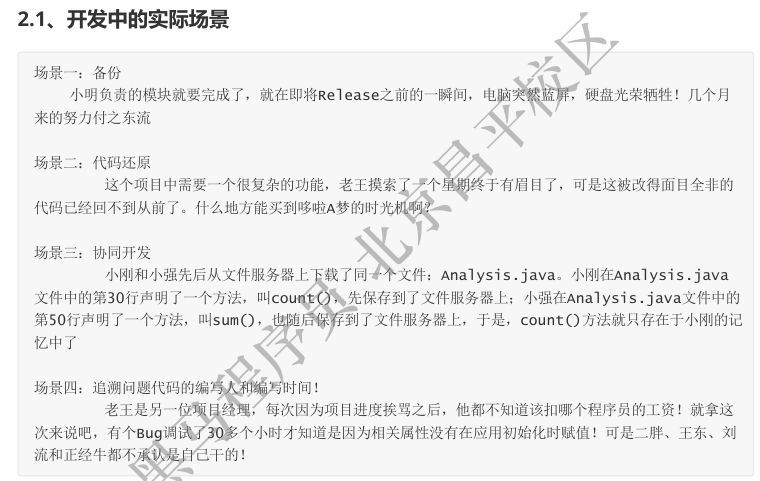

### 怎么办：

#### （1）集中式版本控制工具svn和分布式版本控制工具git

==架构==

- **SVN**：集中式版本控制系统（CVCS）。代码仓库存储在一个中央服务器上，开发者从中央服务器检出（checkout）代码并提交（commit）更改。所有的版本历史记录也都存储在中央服务器上。
- **Git**：分布式版本控制系统（DVCS）。每个开发者的工作目录都是一个完整的代码仓库，包括所有的版本历史记录。开发者可以在本地仓库中提交更改，然后将更改推送到远程仓库。

==工作流程==

- **SVN**：开发者需要连接到中央服务器才能提交更改和查看历史记录。工作流程通常是检出代码、修改、提交。
- **Git**：开发者可以在本地仓库中提交更改，然后在适当的时候将更改推送到远程仓库。工作流程包括克隆（clone）仓库、创建分支、修改代码、提交更改、合并分支、推送（push）和拉取（pull）更改。

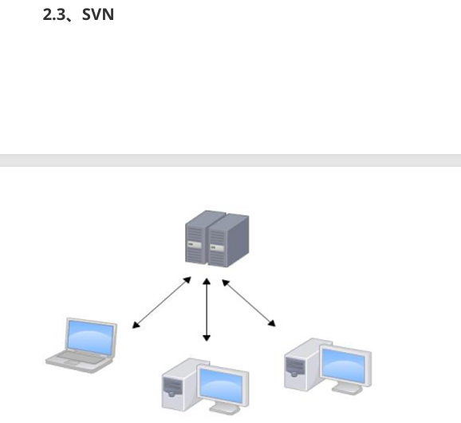

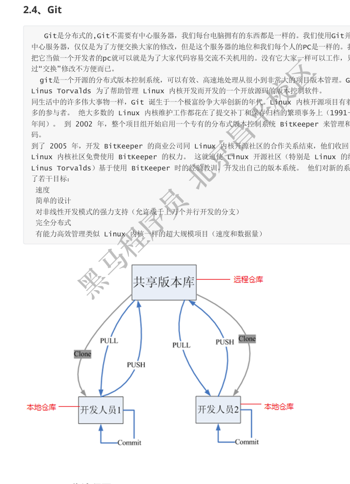

#### （2）Git工作流程

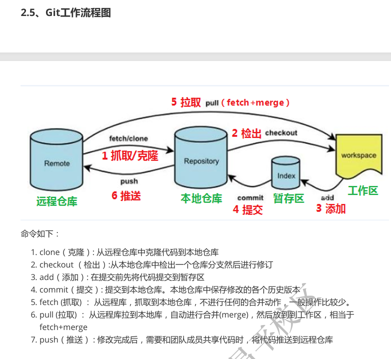

## 2、git安装与常用命令

### （1）git下载与安装

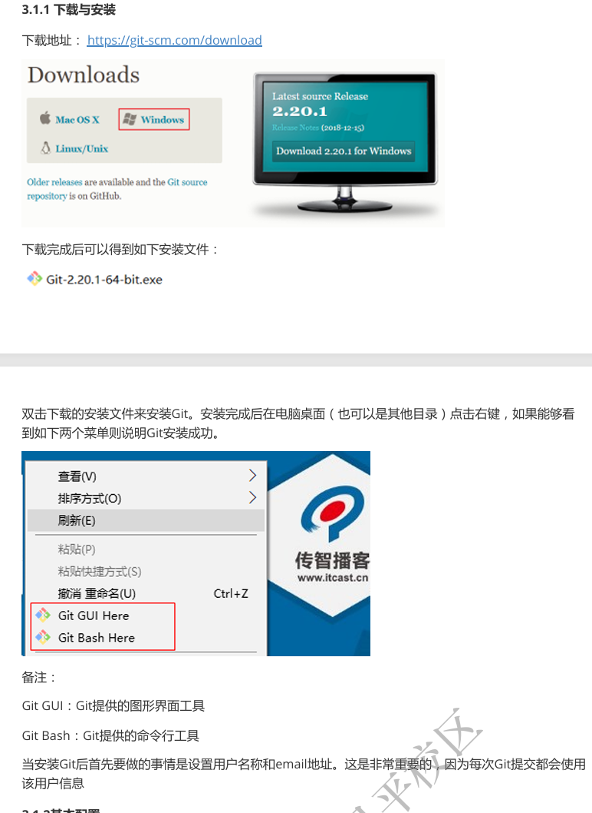

### （2）git基本配置

#### ①设置与查看用户信息

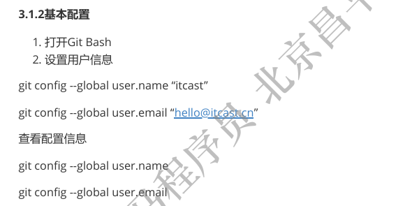

#### ②为常用指令配置别名（可选）

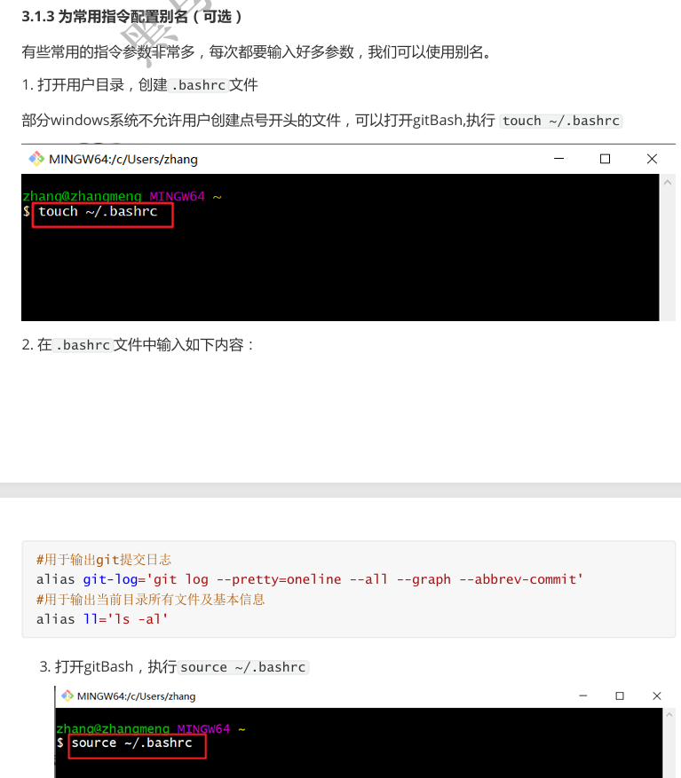

#### ③解决gitbash乱码问题

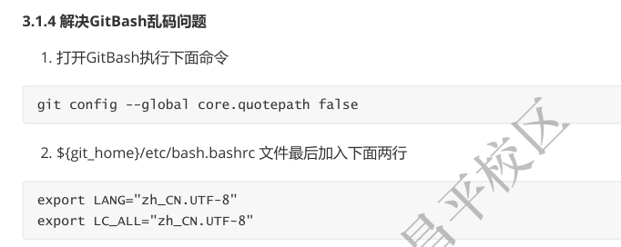

### （3）创建本地仓库

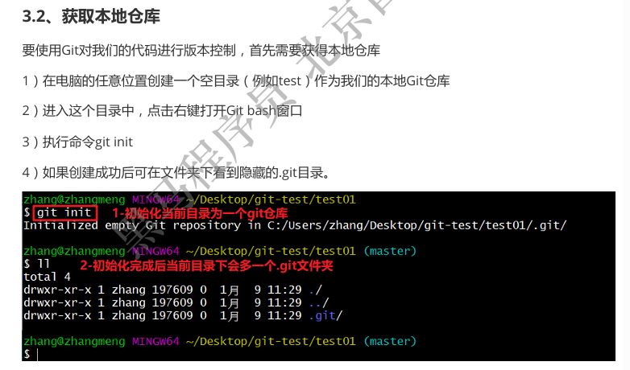

注意这里的.git目录是隐藏起来的，需要设置让它显示出来

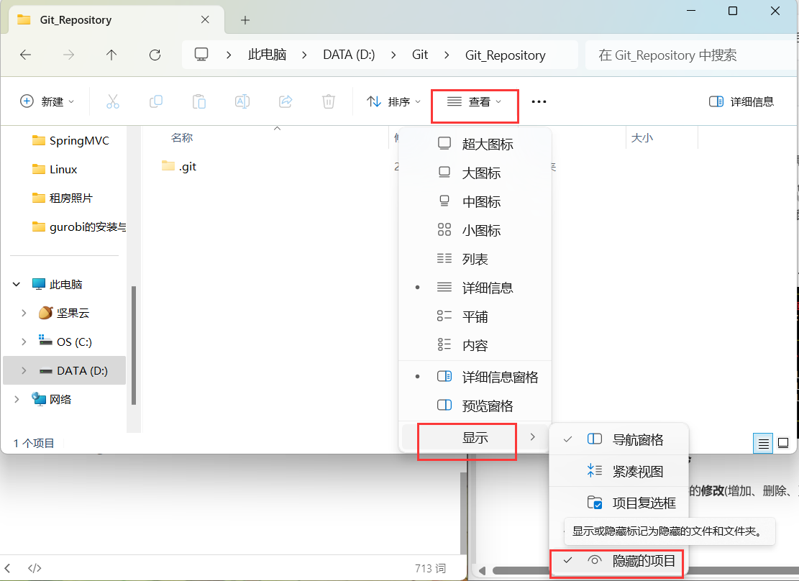

#### notes：如何理解git仓库？

仓库的作用是用来存放文件的，git仓库也不例外，git仓库里面的文件具体又是放在一个个分支上面的，当创建一个仓库以后会生成一个默认的主分支，初始的时候所有文件都是存放在这个主分支上的，这个主分支的名称是 `main`或者 `master`（具体取决于git版本），这个主分支目前是不存在的只有当执行了commit操作以后分支才实际存在。

### （4）基础操作指令

#### ①`git status`查看当前分支下文件的修改状态（文件是否被添加到暂存区、是否被提交到本地仓库等）

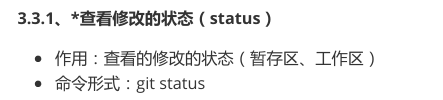

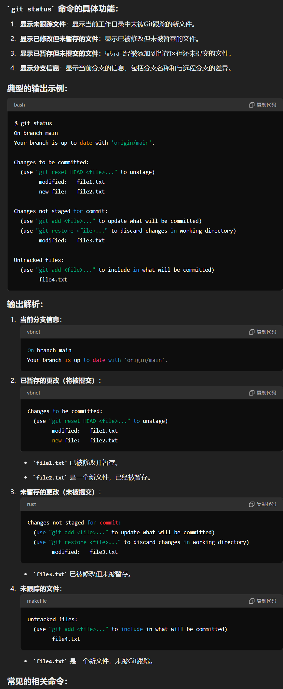

#### ②`git add 文件名`将当前分支下指定的文件添加到暂存区

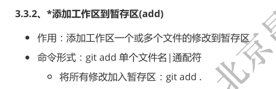

这里`git add 单个文件名`就是将单个文件的修改添加到暂存区，`git add .`通配符的形式就是将所有文件的修改添加到暂存区

#### ③`git commit`将当前分支下暂存区的内容提交到本地仓库（commit操作会影响本地仓库中的当前分支，不会影响仓库中别的分支）

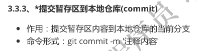

notes：`git commit -m '注释内容'`中的`-m`选项表示用来解释当前提交的具体内容的，方便别人了解这次提交做了什么事情

#### ④`git log`查看提交日志

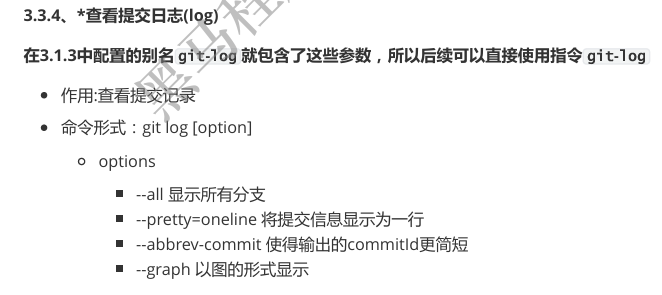

#### ⑤`git reset --hard commitID`将当前分支切换到历史提交的版本

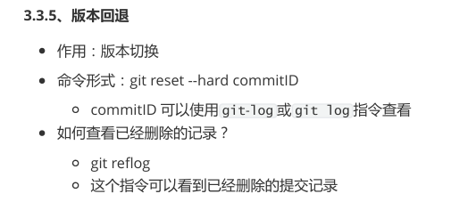

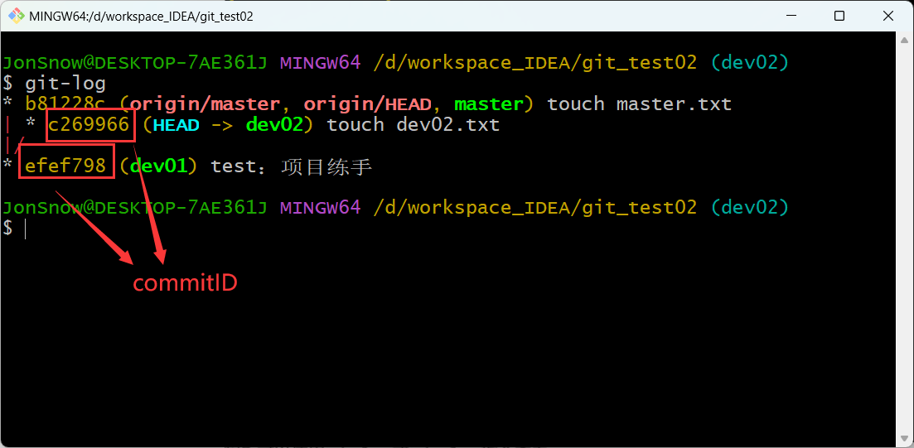

#### ⑥`.gitignore`文件

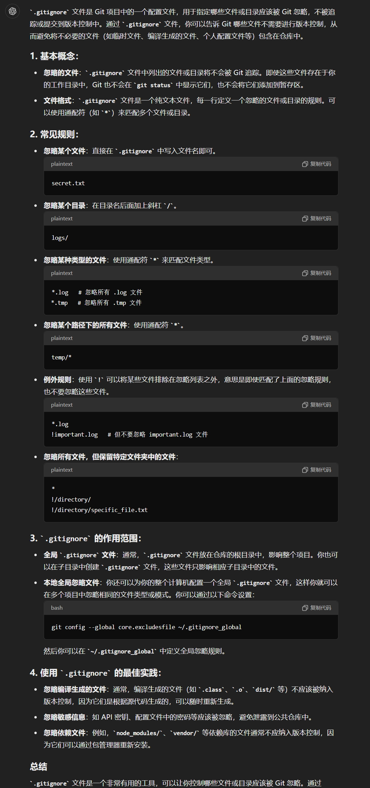

### notes：有关分支的代码冲突和分支的历史版本问题

（1）一个项目的本地分支和远程分支已经同步过了，这个分支只有我在使用，我在本地分支上删除了部分代码再推送上去的时候，此时新的代码会覆盖住旧的代码，也就是说远程分支中的部分代码也被删除了，此时不会发生冲突，因为冲突需要两个人关于==同一个分支==的==同一个代码行==做了==不同的操作==才行

- 如何让两个人关于同一个分支的同一个代码行做不同的操作？比如说都操作`main`分支的第100行代码。
  - 首先当然可以两个人都拉取远程的`main`分支到本地，然后关于第100行做了不同的操作，接着两个人一前一后推送`main`分支到远程仓库此时后推送的那个人就会遇到冲突
  - 还可以两个人分别从`main`分支中又创建新的分支A和B，然后两个人分别在A分支和B分支的第100行做了不同的操作接着一前一后合并到`main`分支，此时后合并的那个人就会遇到冲突

（2）一个项目的代码中添加了很多注释然后又合并了别的分支的代码，并且本地分支和远程分支已经同步过了，现在我将本地分支回滚到添加注释和合并别人代码之前的版本（比如说当前分支有2024-08，2024-09，2024-10，2024-11等版本，将分支回滚到2024-08版本以后则后续的版本都消失了==并且本地分支的提交历史中也不再包含后续的版本==），此时的本地分支是不含注释与别人代码的版本，然后我在本地分支上又修改了代码接着将代码推送到远程分支，此时会显示冲突。可关键是这里为什么会显示冲突呢？这里不是只有我一个人在操作当前这个分支吗？ 

**第一阶段：本地回滚**

1. **当前状态**：
   - 本地分支与远程分支是同步的，且此时的分支包含了「注释」和「合并别的分支的代码」。
2. **执行回滚操作**：
   - 如果你选择了硬回滚（`git reset --hard <commit>`）到添加注释和合并代码之前的某个提交，本地分支将恢复到指定版本的状态。
   - 此时，**本地分支将不再包含注释和合并的代码**，而远程分支仍然保持原来的状态（即包含注释和合并的代码）。

------

**第二阶段：修改代码并推送到远程**

1. **修改后的本地分支状态**：
   - 你在回滚后的版本基础上修改了代码，因此本地分支的状态和远程分支存在差异（本地分支没有注释和合并的代码，而远程有）。
2. **尝试推送代码**：
   - 当你推送时，Git 会检查本地和远程的历史是否一致。如果你的推送与远程分支的最新提交有冲突（因为你回滚删除了远程已有的代码），**Git 会阻止直接推送**，提示你需要先拉取（`git pull`）远程分支的最新变化。
3. **拉取远程分支时发生冲突**：
   - Git 会检测到本地分支和远程分支的差异，尝试合并时出现冲突。
   - 冲突的原因是：远程分支包含的「注释」和「合并的代码」在本地分支中被删除，而本地又引入了新的修改。
   - 你需要手动解决这些冲突。

------

**第三阶段：解决冲突并合并**

1. **解决冲突**：
   - 在解决冲突的过程中，你可以选择保留或者删除远程分支的内容（如注释和合并的代码）。
2. **合并后的代码状态**：
   - 如果你在解决冲突时选择保留远程的「注释」和「合并的代码」，最终的代码会包含这些内容以及你的新修改。
   - 如果你删除了这些内容，则合并后的代码不会再包含注释和之前合并的代码。

------

（3）我有个问题哈，就是前面说过如果一个分支只有我在使用，然后我在本地删除了部分代码接着再推送到远程分支的时候此时新的代码会覆盖旧的代码并不会产生冲突，但是为什么现在本地代码回滚了之后再尝试推送到远程分支的时候会发生冲突呢？冲突不是指的是两个人关于同一个分支的同一个代码行做了不同的修改吗，这里从始至终只有我一个人在操作当前分支啊？

这是一个非常有趣的问题！下面我们详细分析为什么在**回滚后推送会发生冲突**，尽管远程分支只有你在使用。

------

**关键点 1：Git 的提交历史（Commit History）**

Git 判断冲突的依据不仅是代码内容本身，还包括**提交历史（commit history）**。当你回滚到某个历史版本时，**本地分支的提交记录被更改了**，与远程分支的提交历史不再一致。

- 回滚（如 `git reset`）并不会通知远程分支，它只是在本地重置你的提交指针。
- 当你尝试推送时，Git 会比较本地分支的提交历史与远程分支的提交历史，发现两者不一致，从而拒绝推送，要求你先拉取（`git pull`）。

**关键点 2：冲突的定义**

冲突的定义并不局限于两个人修改了相同的代码行，还包括以下场景：

1. **本地分支与远程分支的提交历史不一致**：即使代码内容没有差异，提交历史不同也会阻止直接推送。
2. **代码行的实际冲突**：两边对相同的代码行有不同的修改。

在你的场景中，**冲突的本质是提交历史的分歧**，而不是代码内容的差异。

------

**具体场景的对比**

- **场景 1：删除代码后推送**

  - 如果你在本地删除了部分代码，然后直接推送（没有回滚操作），Git 会直接同步你的本地分支内容到远程分支，远程分支的内容被你的本地分支覆盖。

  - 此时的关键在于**提交历史是线性的**：你的新提交基于远程分支的最新提交，所以推送不会有冲突。

- **场景 2：回滚后推送**

  - 当你回滚到某个历史版本时，本地分支的提交历史与远程分支的最新提交不再一致。回滚操作会让你的本地分支看起来是**退回到旧的历史节点**。

  - 在这种情况下：
    1. 远程分支包含了「注释」和「合并代码」的提交记录。
    2. 本地分支没有这些提交记录（因为回滚），提交历史出现了分叉。
    3. Git 不知道你是否是有意要删除这些提交，还是误操作，因此无法直接推送，要求你解决这种历史分歧。

------

### （5）分支

#### 为什么：

##### ①为什么要有分支？

几乎所有的版本控制系统都以某种形式支持分支。 使用分支意味着你可以把你的工作从开发主线上分离开来进行重大的Bug修改、开发新的功能，以免影响开发主线。

#### 怎么办：

##### ①`git branch`查看本地有哪些分支

###### notes：==当新创建一个本地仓库时，此时还不存在分支，必须commit以后才存在分支==

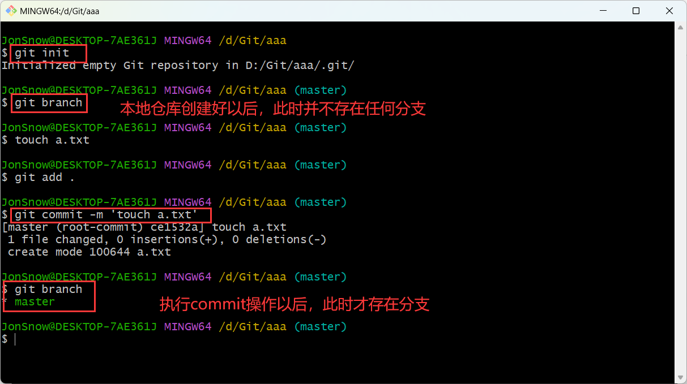

##### ②`git branch 新分支名`在当前分支下创建新的分支

###### notes：这里在本地仓库初始化后通过`git branch 分支名`命令创建新的分支失败了，这是因为初始化git仓库还没有提交对象，此时不存在分支自然无法在当前分支下创建新分支。可以通过`git commit -m "initial commit"`来创建一个初始提交然后就可以在当前分支下创建新分支了。

#### ==notes：有关新创建分支的一些思考==

在master分支下创建新分支dev01此时新分支就独立出去了吗？

当然不是，==分支是以commit操作作为一个个划分节点的==，在老分支的某一个时刻创建新分支以后此时老分支之前所做的那些commit操作也是被新分支共享的（就像是树的生长一样，从主干上生出分支，之前主干上的那些内容也是被分支所共享的）

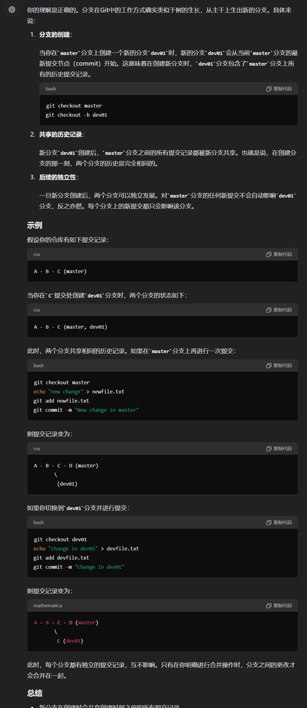

##### ③`git checkout 分支名`从当前分支切换到指定分支

###### notes：`git checkout -b 分支名`还可以从当前分支切换到一个不存在的分支（创建并切换）

##### ④`git merge 分支名`将指定分支合并到当前分支

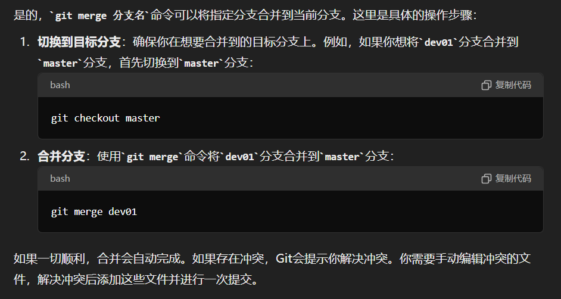

##### notes：合并不同分支的冲突

###### 是什么：

在使用 Git 合并分支时，如果两个分支对同一文件的同一部分（==这里指的同一文件的同一部分指的就是修改的代码所处的位置是第几行，而不是代码涉及的逻辑冲突==）进行了不同的修改就会产生冲突。冲突的发生意味着 Git 无法自动决定使用哪个版本的更改，因此需要开发者手动解决。

分支冲突示例：

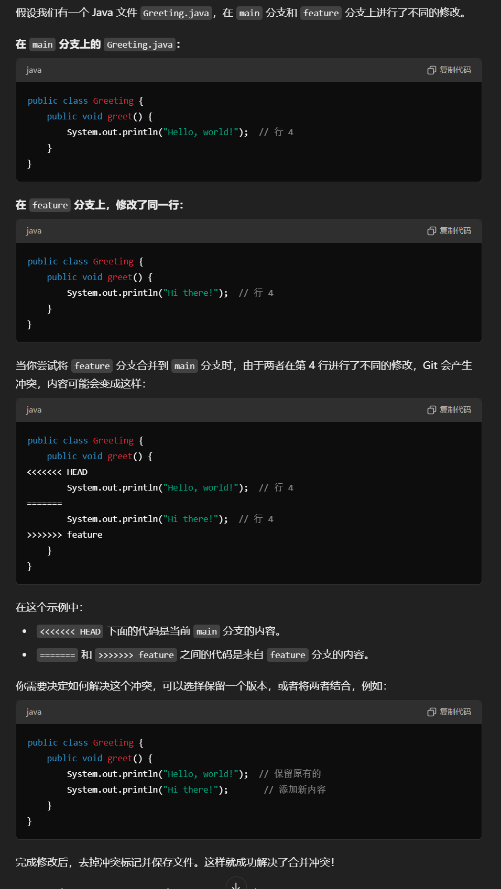

##### notes：解决合并的冲突问题

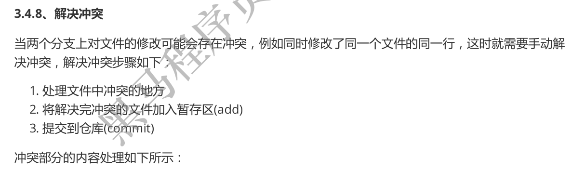

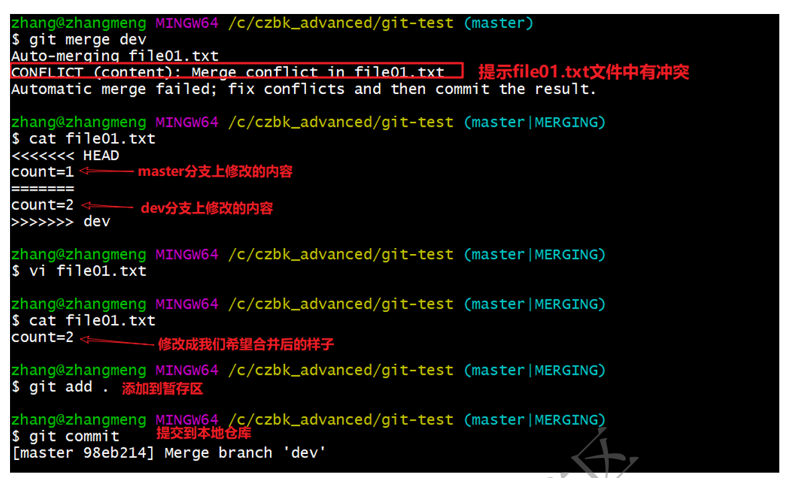

##### ⑤`git branch -d 分支名`删除指定分支，删除前会检查；`git branch -D 分支名`强制删除指定分支，删除前不做任何检查

###### notes：无论哪一种删除都不能删除当前分支

##### ⑥开发中的分支使用原则

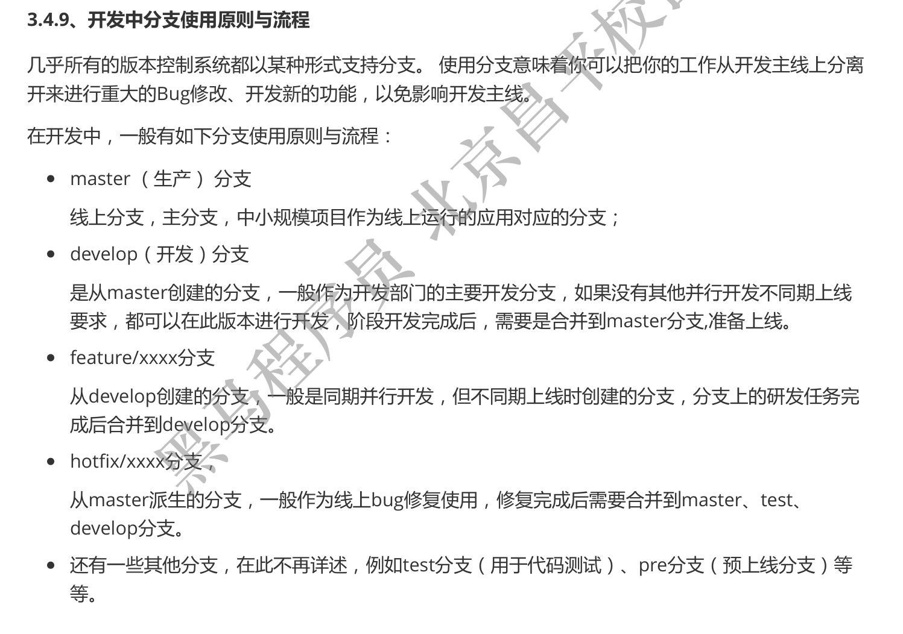

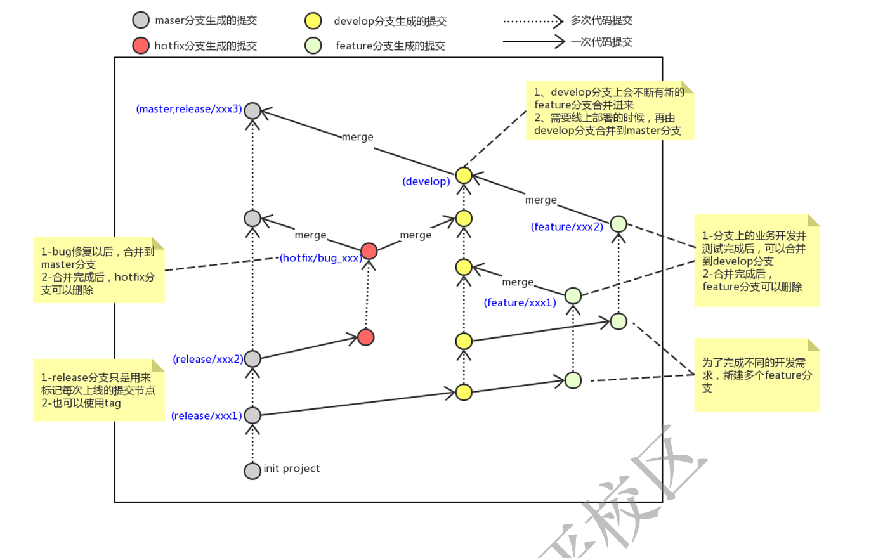

## 3、git远程仓库

### （1）常用的远程仓库

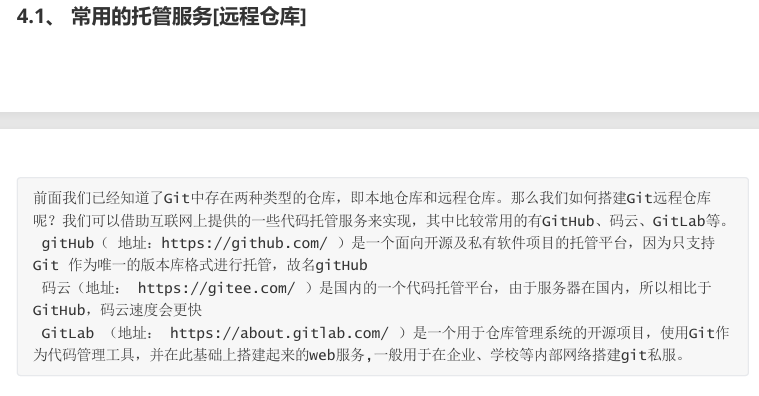

### （2）注册码云

==这里用的微信登录==

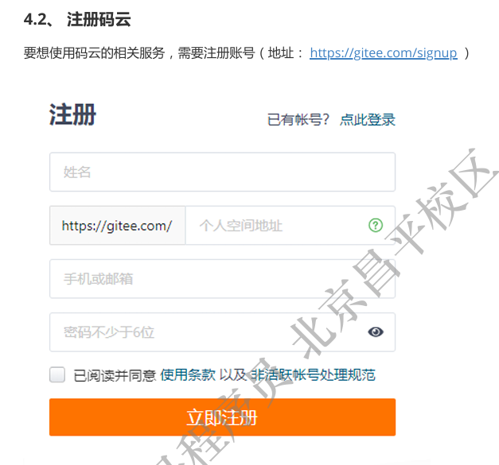

### （3）创建远程仓库

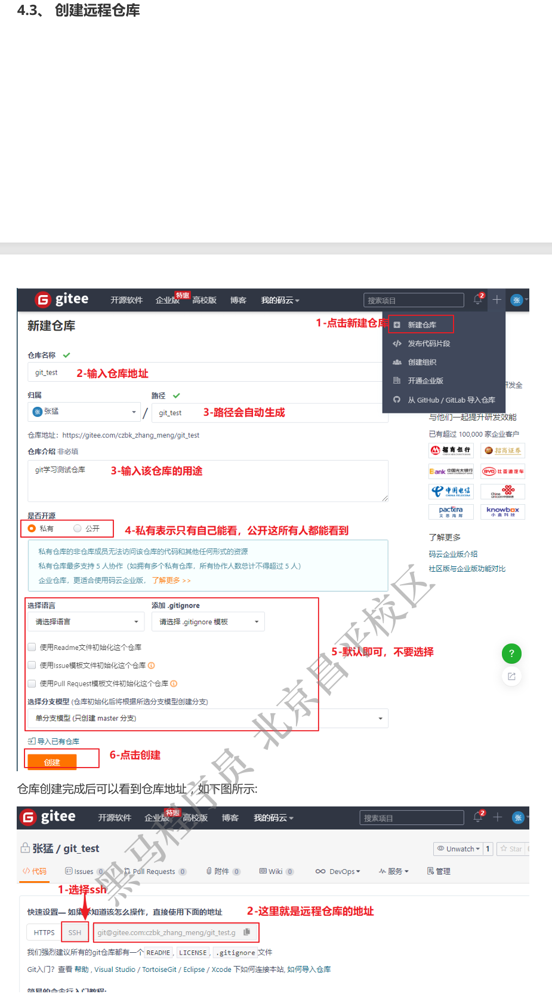

### （4）配置ssh密钥

#### ①在本地随便某个目录下打开终端或者是git bash然后通过`ssh-keygen -t rsa -C "your_email@163.com" -f ~/.ssh/id_rsa`命令生成密钥

==这里的意思是不是说我在A文件夹下通过该命令生成的密钥文件是不是只能给A文件夹下的文件使用，另一个同级的B文件夹下的文件就无法使用该密钥？==

当然不是，只要你的 SSH 密钥存储在 `~/.ssh/` 目录下（或者其他你指定的路径），只要你执行 SSH 连接（如 Git 操作）时，SSH 客户端能够找到该密钥即可。

##### notes：如何理解`ssh-keygen -t rsa -C "your_email@163.com" -f ~/.ssh/id_rsa`命令？

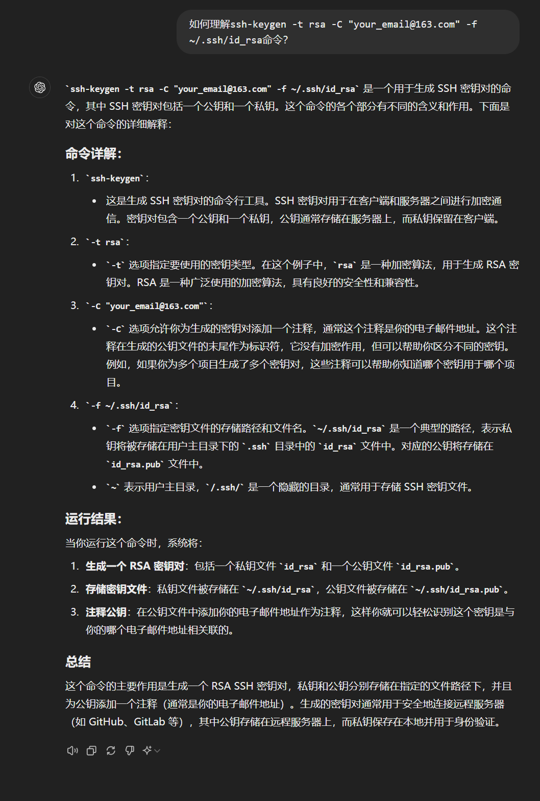

##### notes：有关ssh密码保存位置的理解，可以任意指定密码的保存位置

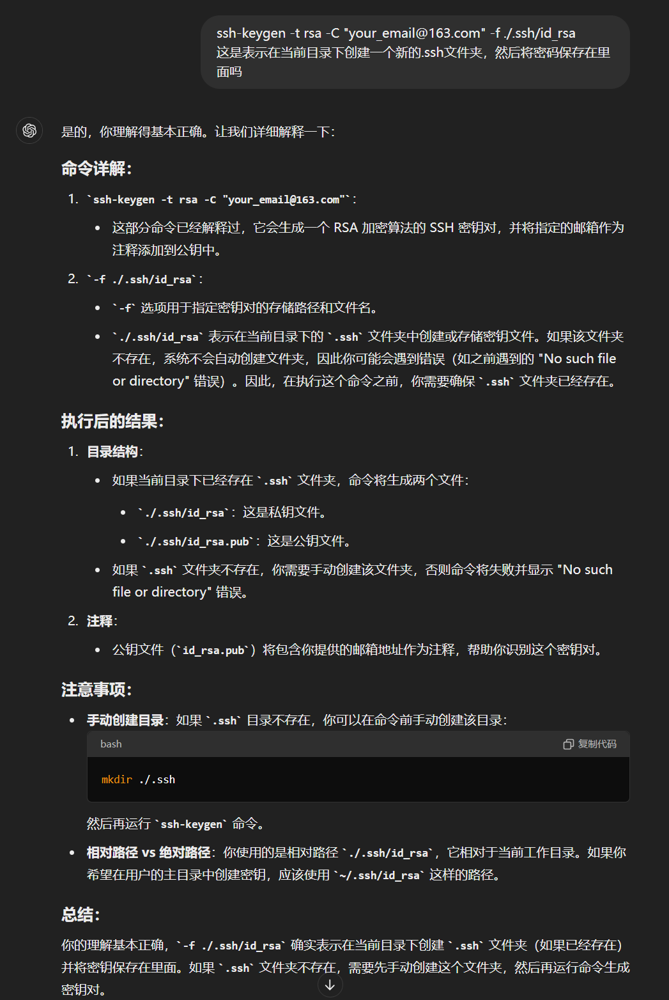

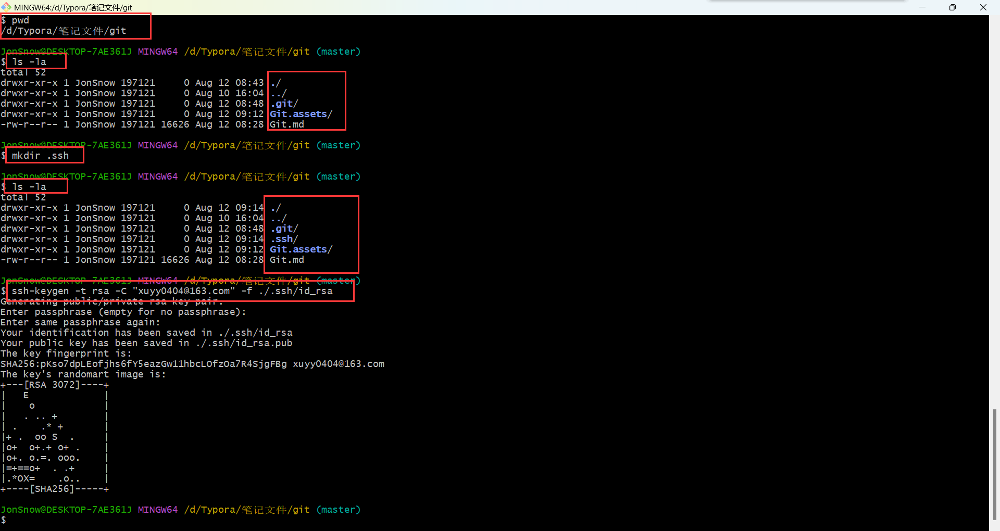

##### notes：有关ssh密码的注意事项，当你在github网站上配置密钥之后它就与当前github用户身份进行绑定

虽然可以任意指定ssh密钥的保存位置，但是当给远程仓库配置了公钥以后每次进行ssh连接的时候系统都会去默认位置即`~/.ssh/`目录下寻找对应的私钥(id_rsa文件)。注意这样一种情况：首先和一个远程仓库A建立连接，将生成的密钥对放到默认位置，此时没有问题；接着和一个新的远程仓库B建立连接，此时生成了一对新的密钥对，依然将它们放到默认位置，此时就会覆盖住旧的密钥对，但是因为没有给远程仓库A配置新的密钥对这就会导致现在没办法连接上仓库A。解决方案有多种：

1. 所有的仓库公用一份密钥对
   - 给仓库A配置新的密钥对（这种方法比较麻烦，因为每次生成新的密钥对都需要重新给旧的远程仓库也配一遍否则就没法连接上旧的远程仓库了）
   - 就不要给仓库B生成新的密钥对了，直接用A之前生成的旧的密钥对（这种方法比较好）

2. 直接给github账户配置ssh密钥就不要单独给账户下的每个仓库配置密钥了，这样用一份密钥就可以连接该账户下所有的仓库

==当你在github网站上配置了ssh密钥以后，该密钥就和当前的github账户进行了绑定==。后续当你上传到远程仓库的时候，仓库是如何识别你到底是谁的呢？就是通过该密钥绑定的github账户，从而判断你是否拥有对于该仓库的读写权限。所以如果你将密钥给了别人然后他来连接你的仓库那么仓库识别到的信息他就是你本人。

##### notes：SSH密钥的作用，是不是只有配置了密钥才能执行`git remote add origin`命令、`git remote -v`命令？

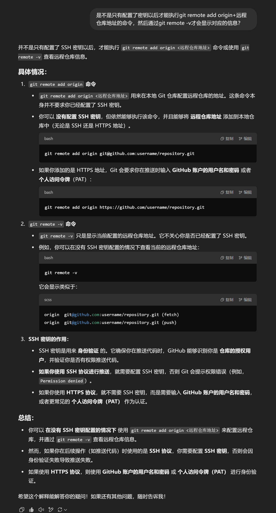

#### ②通过密钥与远程仓库建立连接

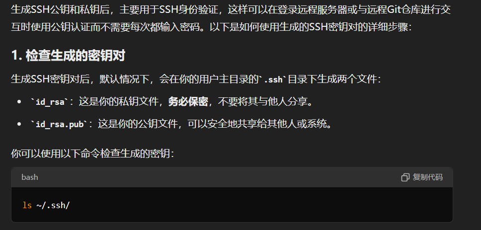

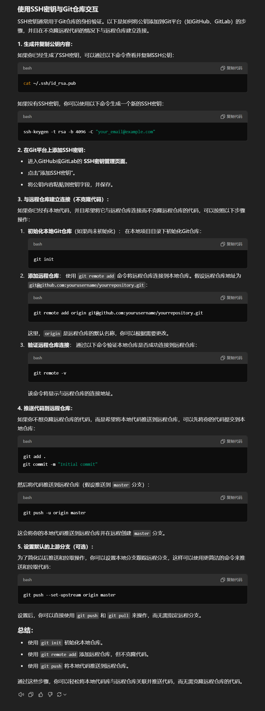

#### notes：有关和远程仓库建立ssh连接的过程中公钥和私钥的使用详细介绍

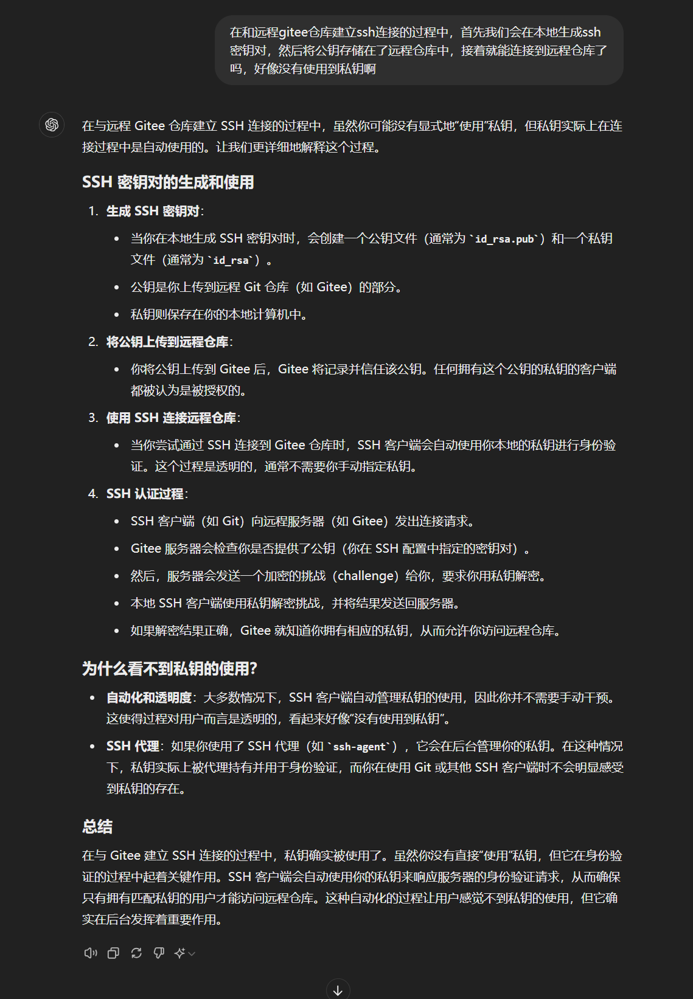

##### notes：如何判断是否与github建立了SSH连接呢？

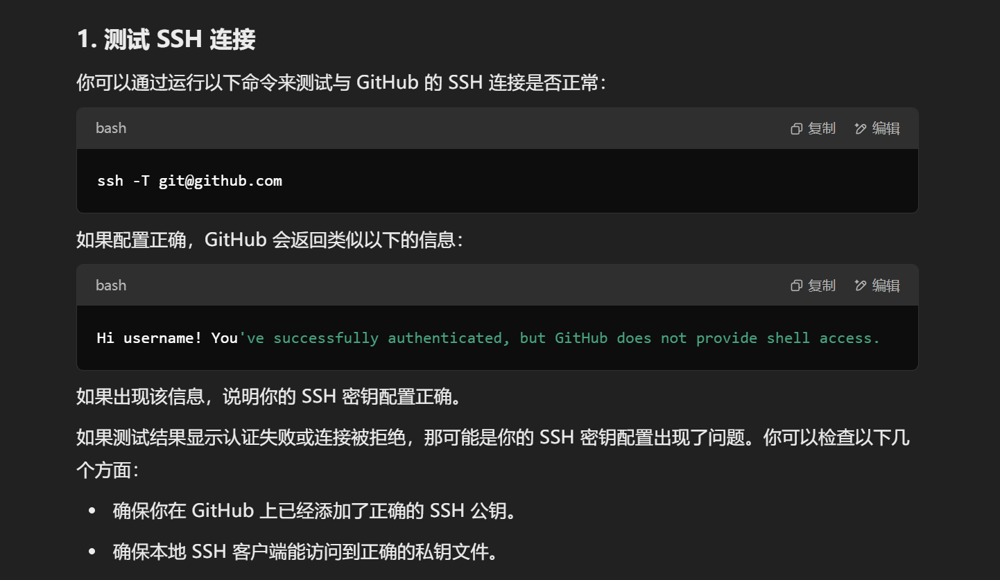

==一定得注意是与github账户建立了ssh连接还是与账户下的某一个仓库建立了ssh连接==

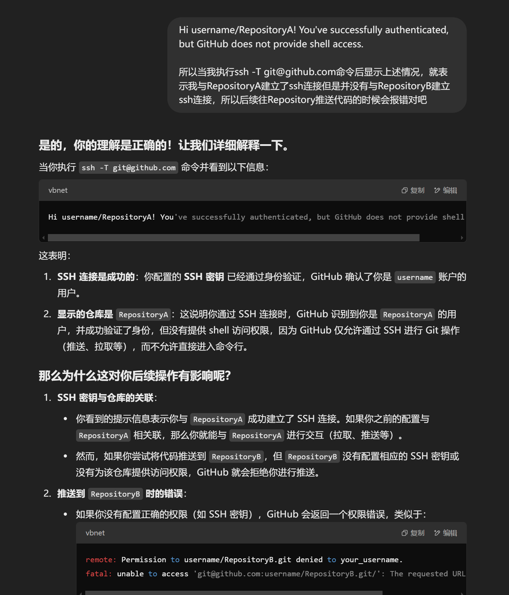

##### notes：创建了github远程私有仓库之后为什么无法推送分支？（因为我当初是与某个仓库建立的ssh连接而不是和github账户建立的连接）

1. 配置ssh密钥（只要给整个github账户配置密钥即可，不用给账户下的每个仓库都配置密钥）

   ==通过密钥来判断是否拥有对github的连接权限，同时给仓库配置了密钥后该密钥就与当前使用的github账户绑定了==

回到当前github起始页面

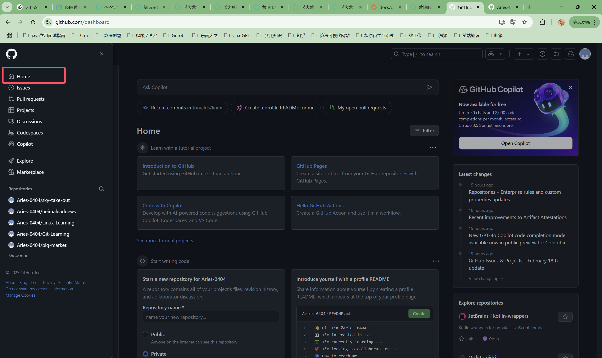

给当前github账户配置ssh密钥（此时这个密钥就与当前账户进行了绑定）

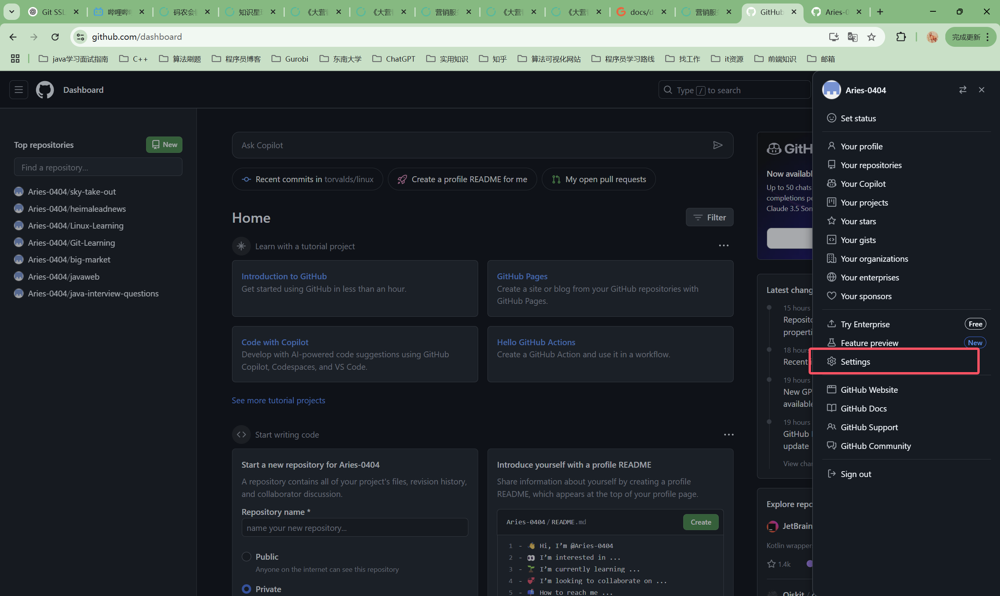

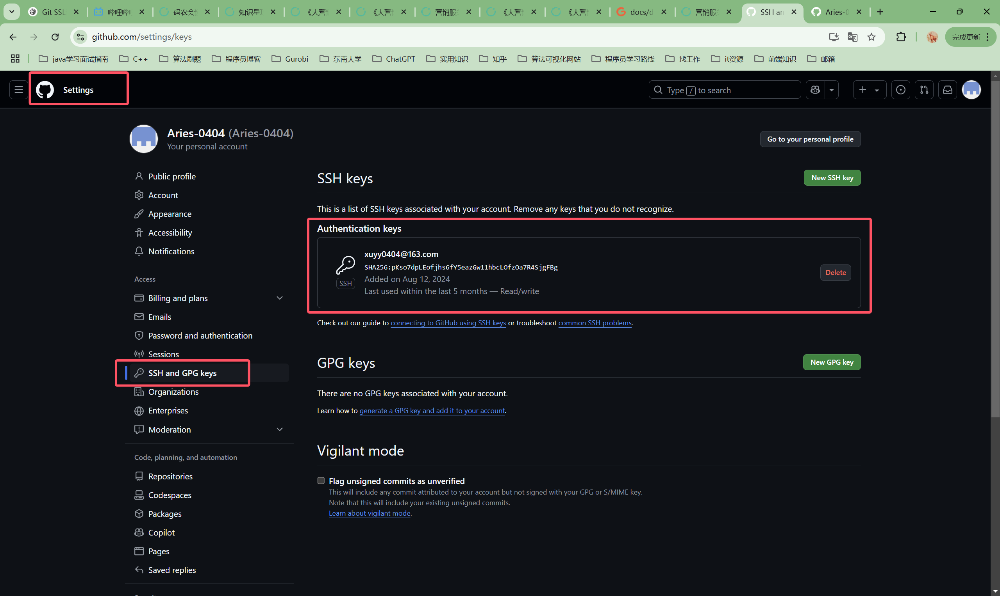

2. 创建了远程的私有仓库之后可以将相关人添加到协作者队列，他就拥有了对于仓库进行读写的权利（如果你是仓库的所有者就不用添加，自动拥有所有权利）

3. 创建本地仓库并添加远程仓库，然后进行文件推送

注意这里git仓库本地也会配置用户名和email地址等信息，但是这些并不影响推送。==那么github仓库是到底是如何识别推送者是谁以及它是否拥有仓库的读写权限的呢？==

还是ssh密钥，当你在github网站配置ssh密钥的时候它就与当前网站用户的身份进行了绑定，后续当你使用这个密钥的时候它就能根据该密钥识别到你是那个用户，从而判断你是否拥有该仓库的读写权利等。

正常情况到这里一切都顺利结束了，但是这里出现了一些问题，就是我怎么都无法上传文件，显示我对于该仓库没有权限，我试过很多遍都不行（==因为我之前是与RepositoryA建立的ssh连接，现在要操作RepositoryB所以当然不行==），后续重新生成了密钥文件并配置到了github账户上，一切就解决了。

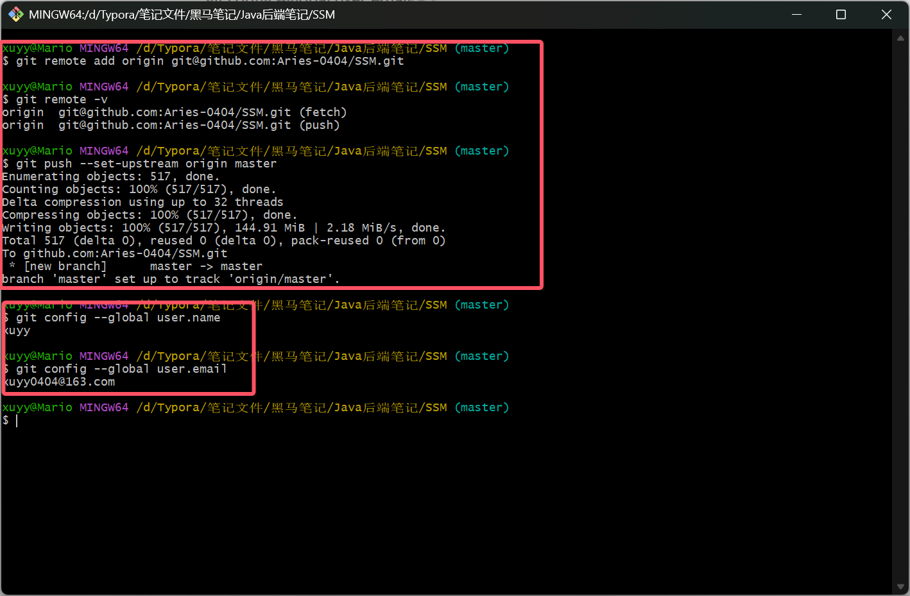

### （5）操作远程仓库

#### ①`git remote add <远端名称> <仓库路径>`将当前本地仓库与远程仓库建立连接

##### notes：上述命令的执行可以是在本地的任何一个git仓库中，但是必须是git仓库不能是随便的一个文件夹下

##### notes：注意这里仅仅是本地仓库与远程仓库之间建立了连接，分支之间还没有建立连接，前面我们也说过在git仓库中文件都是存储在一个个分支上面的，所以也就是说此时本地仓库和远程仓库之间还没有文件上的联系

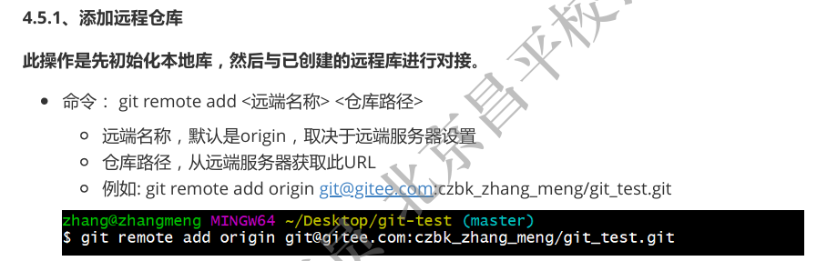

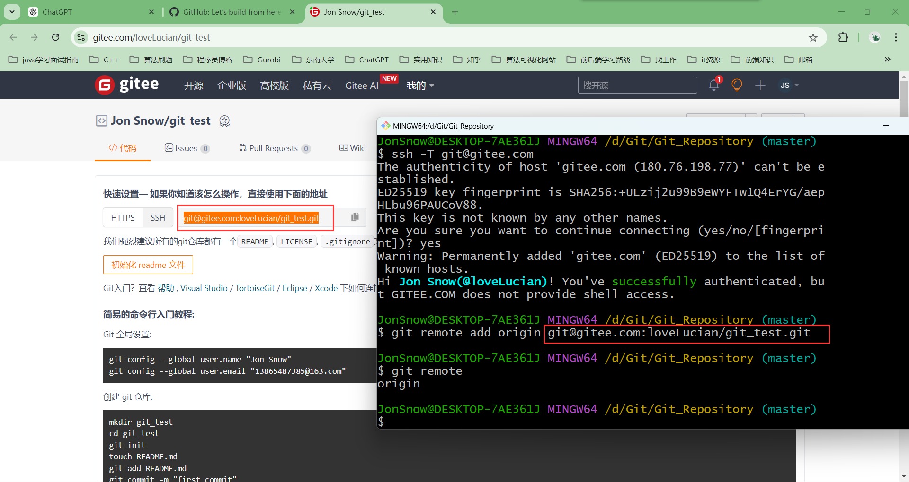

#### ②`git remote -v`查看当前本地仓库连接的所有远程仓库的地址

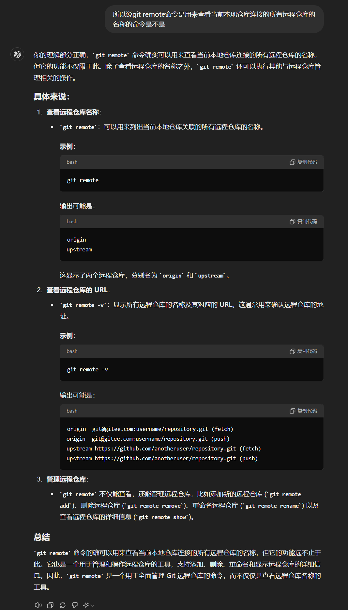

#### ③`git push [-f] [--set-upstream] [远端名称] [本地分支][：远端分支]`将本地分支推送到远程分支

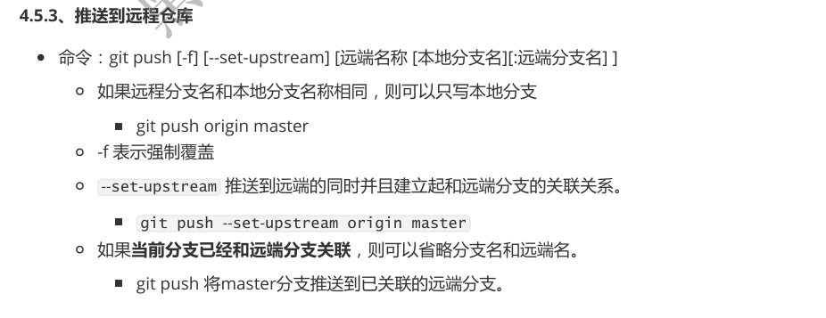

#### ④`git branch -vv`查看本地分支与远程分支的对应关系（即本地哪个分支对应远程哪个分支）

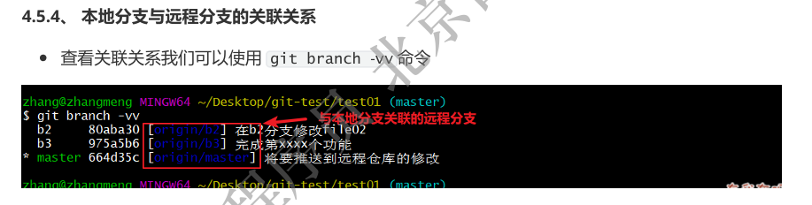

#### ⑤`git fetch [远端名称][远端分支名]`将远程分支抓取到本地仓库

##### ==notes：如何理解`git fetch [远端名称][远端分支名]`指令和远程跟踪分支？==

- 场景1：如果远程仓库创建了一个新的分支`origin dev`则本地是不知道的，得通过`git fetch`指令将该远程分支拉取到本地成为一个远程跟踪分支`origin/dev`，此时本地就知道了远程有这么个分支存在

- 场景2：远程仓库的`dev`分支进行了一些修改但是本地目前是看不到这些修改的，此时就可以通过`git fetch origin dev`指令可以将远程仓库`dev`分支中的更新下载到本地并保存在本地的`origin/dev`分支（远程跟踪分支）中，不会影响本地当前的分支（那这就有一个问题哈，假如本地当前的分支就是`origin/dev`分支呢？这是不可能的，具体解释很麻烦，涉及到远程跟踪分支，可以将这个远程跟踪分支理解成一个实际并不存在的分支，即通过`git branch`命令没法在本地找到`origin/dev`分支、也没法通过`git checkout origin/dev`命令切换到本地的`origin/dev`分支，但是后续可以通过`git merge origin/dev`命令将`origin/dev`分支合并到当前分支）。

#### ⑥`git branch -r`查看远程仓库中所有的分支

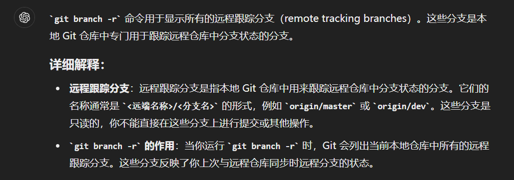

##### notes：注意`git remote -v`是查看远程仓库的地址，`git branch -r`是查看远程仓库的分支

#### ⑦`git pull [远端名称][远端分支名]`将远程分支拉取到本地

##### ==notes：如何理解`git pull [远端名称][远端分支名]`指令？==

通过`git pull`指令可以将远程仓库中指定分支下的更新直接抓取到本地然后和本地当前分支进行合并。

#### ⑧`git clone <仓库路径> [本地目录]`将远程仓库克隆到本地指定目录下

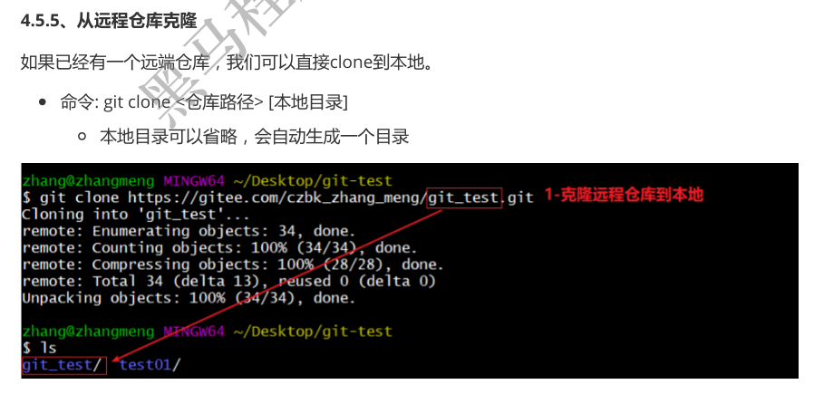

##### notes：有关`git clone`命令执行过程的详细解析

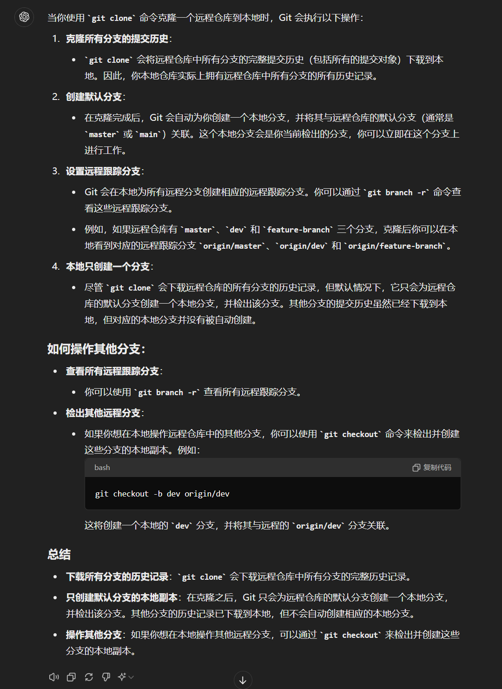

##### notes：`git checkout -b dev origin/dev`指令并不等同于先执行`git branch -b dev`指令、再执行`git checkout dev`、再执行`git merge origin/dev`指令

## 4、在Idea中使用git（因为idea版本的问题，所以不同的idea使用略有差异）

### （1）在Idea中配置git


因为idea版本的问题这里我们点击test按钮没有出现配置成功的信息，这些都无所谓只要出现了关于git的版本信息就代表idea的git配置成功了


### （2）在idea中操作git

#### ①在gitee中创建远程仓库（等同于前面创建远程仓库的步骤）


#### ②初始化本地仓库

##### notes：创建本地仓库以后会出现代码报红的问题，这是因为这些文件还没有提交到本地仓库，执行一次提交操作就好


#### ③将文件提交到本地仓库


#### ④设置远程仓库


#### ⑤推送到远程仓库

##### 方式1：


##### 方式2：（更加方便）


#### ⑥克隆远程仓库到本地


#### ⑦创建分支

##### 方式1：在当前分支的当前位置处创建新的分支

在 IDEA 中按照图示操作创建新分支时，新分支将基于你当前所处分支的最新提交（也就是 HEAD 所指向的位置）创建。这意味着新分支会从你当前所在分支的当前提交处开始。


##### 方式2（最方便的方式）：可以在指定分支的指定位置处创建新的分支

在git log的日志中会显示各个分支的各个提交节点，我们可以选择想要的节点位置然后创建新的分支


#### ⑧其他分支操作


#### ⑨有关冲突的操作


##### notes：当A、B两个人连接了同一个远程仓库并且拉取了同一个远程分支然后修改了同一个文件的代码行再执行push操作，则后提交的那个人会提交失败，因为文件冲突，解决方法是什么？

后提交的人需要先获取远程仓库的代码到本地，解决好冲突以后再执行push操作

## notes：在idea中集成gitbash作为终端


### 为什么：

idea中可以选择terminal的种类，有windows中的cmd终端等但是该终端没法识别诸如git add等指令（其实只要我们将git的bin目录添加到Path环境变量中，不管是cmd终端还是什么都能够识别git命令的，但是这里暂时没有识别出来也不知道是什么问题），所以选择集成gitbash作为idea的terminal

